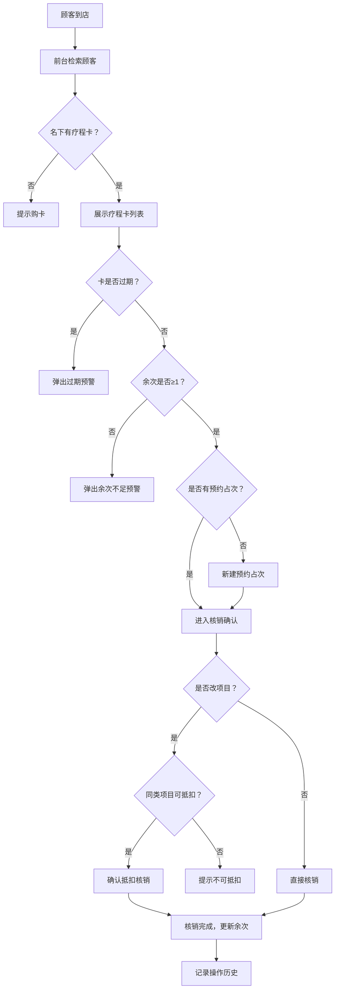

## 1. 产品概述

医美前台疗程卡余次管理 Web 工作台，面向连锁医美门诊前台团队，解决顾客到店时"还剩几次、能不能做、是否过期"查不清的核心痛点。系统涵盖顾客检索、疗程卡档案、到店核销、预约占次、余次预警、异常处理与交接记录六大模块，实现疗程卡全生命周期的精细化管理。

- 目标用户：连锁医美门诊前台接待、咨询师、店长
- 核心价值：消除余次管理盲区，防止重复安排、误核销、过期遗漏，提升前台工作效率与顾客体验

## 2. 核心功能

### 2.1 用户角色

| 角色 | 权限说明 |
|------|----------|
| 前台接待 | 顾客检索、预约占次、核销确认、查看预警、导出交接报表 |
| 咨询师 | 核销确认（含项目/操作师/房间/耗材）、异常处理申请 |
| 店长 | 退卡/赠送/补扣/误扣恢复审批、交接记录查看、全店数据导出 |

### 2.2 功能模块

1. **工作台首页**：今日概览（待核销预约数、预警卡片数、异常待处理数）、快捷检索入口、预警弹窗
2. **顾客检索页**：按手机号/姓名/病历号快速查卡，展示名下所有疗程卡及余次状态
3. **疗程卡档案页**：单卡详情（项目名称、总次数、已用次数、冻结次数、有效期）、操作历史时间线
4. **到店核销页**：预约列表→确认项目/操作师/房间/耗材→核销扣次，支持临时改项目时的同类抵扣提示
5. **预约占次页**：为顾客预约时暂占一次，显示已占/可用次数，到期自动释放
6. **余次预警中心**：卡快到期（≤7天）或只剩1次时自动弹出提醒，支持批量导出预警名单
7. **异常处理与交接记录页**：退卡/赠送/补扣/误扣恢复均需填原因留痕；每日交班按门店导出未核销预约、当日核销明细和异常卡片

### 2.3 页面详情

| 页面名称 | 模块名称 | 功能描述 |
|----------|----------|----------|
| 工作台首页 | 今日概览卡片 | 展示待核销数、预警数、异常待处理数，点击可跳转对应模块 |
| 工作台首页 | 快捷检索栏 | 支持手机号/姓名/病历号输入，回车即搜 |
| 工作台首页 | 预警弹窗 | 卡片到期≤7天或余次=1时自动弹出，支持一键提醒续卡 |
| 顾客检索页 | 多条件搜索栏 | 手机号/姓名/病历号三选一或组合搜索 |
| 顾客检索页 | 顾客信息卡 | 展示姓名、手机号、病历号、名下卡数量 |
| 顾客检索页 | 疗程卡列表 | 每张卡展示项目名、总次数/已用/冻结/剩余、有效期、状态标签 |
| 疗程卡档案页 | 卡片基本信息 | 项目名称、购卡日期、总次数、已用次数、冻结次数、剩余次数、有效期、状态 |
| 疗程卡档案页 | 操作历史时间线 | 按时间倒序展示核销、预约占次、异常操作等记录 |
| 疗程卡档案页 | 快捷操作按钮 | 预约占次、核销、异常处理入口 |
| 到店核销页 | 待核销预约列表 | 按日期排列，显示顾客、项目、预约时间、操作师、房间 |
| 到店核销页 | 核销确认表单 | 确认项目、操作师、房间、耗材，提交核销 |
| 到店核销页 | 改项目提示 | 临时改项目时弹出同类项目抵扣确认框 |
| 预约占次页 | 预约日历视图 | 按日期/周展示已占次时段，避免冲突 |
| 预约占次页 | 占次表单 | 选择顾客、疗程卡、项目、日期、操作师，提交暂占 |
| 预约占次页 | 已占次列表 | 展示占次详情，支持取消释放 |
| 余次预警中心 | 预警列表 | 按紧急程度排序，到期预警和余次预警分组显示 |
| 余次预警中心 | 批量导出 | 导出预警名单为 Excel |
| 异常处理页 | 异常操作表单 | 退卡/赠送/补扣/误扣恢复选择，填写原因，提交留痕 |
| 异常处理页 | 异常记录列表 | 按时间倒序展示所有异常操作及原因 |
| 交接记录页 | 交班报表 | 按门店+日期筛选，展示未核销预约、当日核销明细、异常卡片 |
| 交接记录页 | 导出功能 | 支持导出交班报表 |

## 3. 核心流程

**顾客到店核销主流程**：顾客到店 → 前台检索顾客 → 查看疗程卡余次 → 确认卡未过期且有余额 → 核销扣次（咨询师确认项目/操作师/房间/耗材）→ 核销完成，更新余次。

**预约占次流程**：前台为顾客预约 → 选择疗程卡 → 系统暂占1次 → 顾客到店 → 核销确认 → 占次转为已用；若未到店则到期自动释放。

**异常处理流程**：发起异常操作（退卡/赠送/补扣/误扣恢复）→ 填写原因 → 店长审批 → 执行变更 → 留痕记录。

## 4. 用户界面设计

### 4.1 设计风格

- **主色调**：温暖玫瑰金（#B76E79）搭配深灰底色（#1A1A2E），传达医美行业的高级感与专业感
- **辅助色**：柔粉（#F5E6E0）用于背景，翡翠绿（#2ECC71）用于正常状态，琥珀橙（#F39C12）用于预警，珊瑚红（#E74C3C）用于异常/过期
- **按钮风格**：圆角胶囊按钮，主操作使用玫瑰金实色填充，次要操作使用描边样式
- **字体**：标题使用 Noto Serif SC 衬线体营造优雅感，正文使用 Noto Sans SC 无衬线体保证可读性
- **布局风格**：左侧固定导航栏 + 右侧内容区，卡片式模块布局，数据表格使用圆角行样式
- **图标风格**：使用 lucide-react 线性图标，统一 20px 尺寸，线条粗细 1.5px

### 4.2 页面设计概览

| 页面名称 | 模块名称 | UI元素 |
|----------|----------|--------|
| 工作台首页 | 今日概览 | 三列统计卡片，玫瑰金渐变边框，数字大号加粗，图标右上角装饰 |
| 工作台首页 | 快捷检索 | 居中搜索框，毛玻璃背景，搜索图标左侧，输入时下拉联想 |
| 工作台首页 | 预警弹窗 | 右下角滑入通知，琥珀橙左边框，倒计时高亮显示 |
| 顾客检索页 | 搜索栏 | 标签切换（手机号/姓名/病历号），输入框带清空按钮 |
| 顾客检索页 | 顾客信息卡 | 左侧头像+基本信息，右侧疗程卡缩略列表，卡片悬浮阴影效果 |
| 疗程卡档案页 | 基本信息区 | 顶部大卡片，进度条展示余次占比，状态标签彩色胶囊 |
| 疗程卡档案页 | 时间线 | 左侧竖线+圆点，右侧操作详情，不同操作类型用不同颜色圆点 |
| 到店核销页 | 核销列表 | 表格行悬浮高亮，状态列使用彩色标签，操作列按钮组 |
| 到店核销页 | 核销表单 | 模态弹窗，表单分步引导（选项目→选人员→选房间→确认耗材） |
| 预约占次页 | 日历视图 | 周视图为主，时段格内显示占次标记，可拖拽调整 |
| 预约占次页 | 占次列表 | 卡片列表，冻结状态显示冰蓝底色，到期倒计时 |
| 余次预警中心 | 预警列表 | 分组折叠面板，紧急项默认展开，非紧急折叠 |
| 异常处理页 | 操作表单 | 模态弹窗，操作类型单选，原因文本域必填，提交前二次确认 |
| 交接记录页 | 报表区 | 三标签页切换（未核销/已核销/异常），表格支持排序筛选 |

### 4.3 响应式设计

- 桌面优先设计，最小支持 1280px 宽度
- 平板（768px-1024px）：侧边栏收缩为图标模式，表格列数适当减少
- 不适配手机端（医美前台固定使用桌面电脑）

### 4.4 无3D场景
