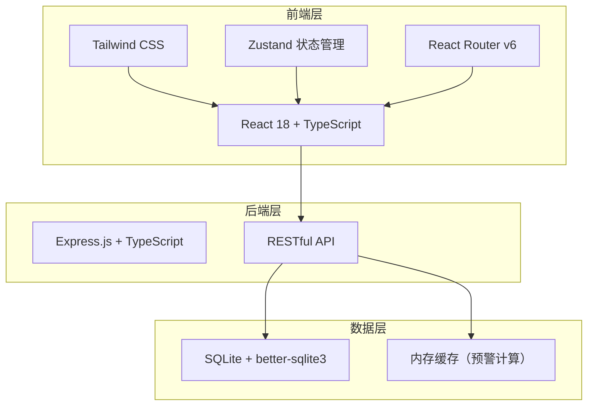
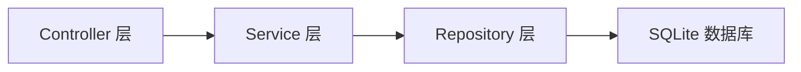
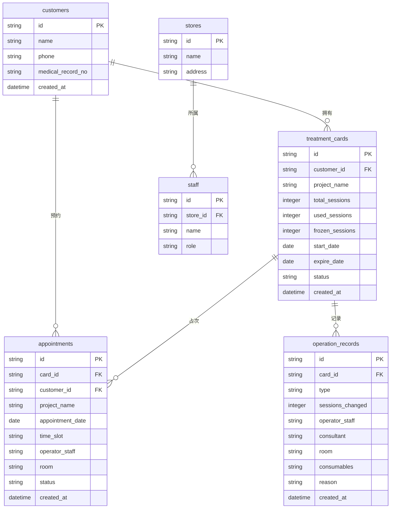

## 1. 架构设计



## 2. 技术说明

- **前端**：React@18 + TypeScript + Tailwind CSS@3 + Vite
- **初始化工具**：vite-init（react-express-ts 模板）
- **后端**：Express@4 + TypeScript（ESM 格式）
- **数据库**：SQLite（better-sqlite3），适合单门店/轻量部署场景
- **状态管理**：Zustand
- **图标库**：lucide-react
- **字体**：Noto Serif SC + Noto Sans SC（Google Fonts CDN）

## 3. 路由定义

| 路由 | 用途 |
|------|------|
| `/` | 工作台首页，今日概览与快捷检索 |
| `/search` | 顾客检索页，按手机号/姓名/病历号查卡 |
| `/card/:id` | 疗程卡档案页，单卡详情与操作历史 |
| `/verify` | 到店核销页，待核销列表与核销确认 |
| `/appointment` | 预约占次页，日历视图与占次管理 |
| `/alert` | 余次预警中心，预警列表与批量导出 |
| `/exception` | 异常处理页，异常操作与记录列表 |
| `/handover` | 交接记录页，交班报表与导出 |

## 4. API 定义

### 4.1 顾客相关

```typescript
interface Customer {
  id: string;
  name: string;
  phone: string;
  medicalRecordNo: string;
  createdAt: string;
}

// GET /api/customers/search?keyword=xxx&field=phone|name|medicalRecordNo
interface SearchCustomersResponse {
  customers: (Customer & { cardCount: number })[];
}
```

### 4.2 疗程卡相关

```typescript
interface TreatmentCard {
  id: string;
  customerId: string;
  projectName: string;
  totalSessions: number;
  usedSessions: number;
  frozenSessions: number;
  remainingSessions: number;
  startDate: string;
  expireDate: string;
  status: "active" | "expired" | "frozen" | "refunded";
  createdAt: string;
}

// GET /api/customers/:id/cards
interface GetCustomerCardsResponse {
  cards: TreatmentCard[];
}

// GET /api/cards/:id
interface GetCardDetailResponse {
  card: TreatmentCard;
  history: OperationRecord[];
}
```

### 4.3 操作记录

```typescript
interface OperationRecord {
  id: string;
  cardId: string;
  type: "verify" | "appointment" | "cancel_appointment" | "refund" | "gift" | "adjust" | "recover";
  sessionsChanged: number;
  operator: string;
  consultant?: string;
  room?: string;
  consumables?: string;
  reason?: string;
  createdAt: string;
}
```

### 4.4 预约核销

```typescript
interface Appointment {
  id: string;
  cardId: string;
  customerId: string;
  projectName: string;
  appointmentDate: string;
  timeSlot: string;
  operator: string;
  room: string;
  status: "reserved" | "verified" | "cancelled" | "expired";
  createdAt: string;
}

// POST /api/appointments
interface CreateAppointmentRequest {
  cardId: string;
  projectName: string;
  appointmentDate: string;
  timeSlot: string;
  operator: string;
  room: string;
}

// POST /api/appointments/:id/verify
interface VerifyAppointmentRequest {
  consultant: string;
  operator: string;
  room: string;
  consumables: string;
  changeProject?: string;
  allowOffset?: boolean;
}

// POST /api/appointments/:id/cancel
interface CancelAppointmentRequest {
  reason: string;
}
```

### 4.5 异常处理

```typescript
// POST /api/cards/:id/exception
interface ExceptionRequest {
  type: "refund" | "gift" | "adjust" | "recover";
  sessionsChanged: number;
  reason: string;
  operator: string;
}
```

### 4.6 预警与交接

```typescript
// GET /api/alerts?type=expiring|low_sessions|all
interface GetAlertsResponse {
  alerts: (TreatmentCard & { alertType: string; daysLeft?: number })[];
}

// GET /api/handover?date=yyyy-mm-dd&store=xxx
interface GetHandoverResponse {
  unverifiedAppointments: Appointment[];
  verifiedDetails: (OperationRecord & { customerName: string; projectName: string })[];
  exceptionCards: (TreatmentCard & { customerName: string; exceptionType: string })[];
}
```

## 5. 服务器架构图



## 6. 数据模型

### 6.1 数据模型定义



### 6.2 数据定义语言

```sql
CREATE TABLE stores (
  id TEXT PRIMARY KEY,
  name TEXT NOT NULL,
  address TEXT NOT NULL
);

CREATE TABLE staff (
  id TEXT PRIMARY KEY,
  store_id TEXT NOT NULL REFERENCES stores(id),
  name TEXT NOT NULL,
  role TEXT NOT NULL CHECK(role IN ('receptionist', 'consultant', 'manager'))
);

CREATE TABLE customers (
  id TEXT PRIMARY KEY,
  name TEXT NOT NULL,
  phone TEXT NOT NULL,
  medical_record_no TEXT NOT NULL UNIQUE,
  created_at TEXT NOT NULL DEFAULT (datetime('now'))
);

CREATE TABLE treatment_cards (
  id TEXT PRIMARY KEY,
  customer_id TEXT NOT NULL REFERENCES customers(id),
  project_name TEXT NOT NULL,
  total_sessions INTEGER NOT NULL,
  used_sessions INTEGER NOT NULL DEFAULT 0,
  frozen_sessions INTEGER NOT NULL DEFAULT 0,
  start_date TEXT NOT NULL,
  expire_date TEXT NOT NULL,
  status TEXT NOT NULL DEFAULT 'active' CHECK(status IN ('active', 'expired', 'frozen', 'refunded')),
  created_at TEXT NOT NULL DEFAULT (datetime('now'))
);

CREATE TABLE appointments (
  id TEXT PRIMARY KEY,
  card_id TEXT NOT NULL REFERENCES treatment_cards(id),
  customer_id TEXT NOT NULL REFERENCES customers(id),
  project_name TEXT NOT NULL,
  appointment_date TEXT NOT NULL,
  time_slot TEXT NOT NULL,
  operator_staff TEXT NOT NULL,
  room TEXT NOT NULL,
  status TEXT NOT NULL DEFAULT 'reserved' CHECK(status IN ('reserved', 'verified', 'cancelled', 'expired')),
  created_at TEXT NOT NULL DEFAULT (datetime('now'))
);

CREATE TABLE operation_records (
  id TEXT PRIMARY KEY,
  card_id TEXT NOT NULL REFERENCES treatment_cards(id),
  type TEXT NOT NULL CHECK(type IN ('verify', 'appointment', 'cancel_appointment', 'refund', 'gift', 'adjust', 'recover')),
  sessions_changed INTEGER NOT NULL,
  operator_staff TEXT NOT NULL,
  consultant TEXT,
  room TEXT,
  consumables TEXT,
  reason TEXT,
  created_at TEXT NOT NULL DEFAULT (datetime('now'))
);

CREATE INDEX idx_customers_phone ON customers(phone);
CREATE INDEX idx_customers_medical_record ON customers(medical_record_no);
CREATE INDEX idx_treatment_cards_customer ON treatment_cards(customer_id);
CREATE INDEX idx_treatment_cards_status ON treatment_cards(status);
CREATE INDEX idx_treatment_cards_expire ON treatment_cards(expire_date);
CREATE INDEX idx_appointments_card ON appointments(card_id);
CREATE INDEX idx_appointments_date ON appointments(appointment_date);
CREATE INDEX idx_appointments_status ON appointments(status);
CREATE INDEX idx_operation_records_card ON operation_records(card_id);
CREATE INDEX idx_staff_store ON staff(store_id);
```
